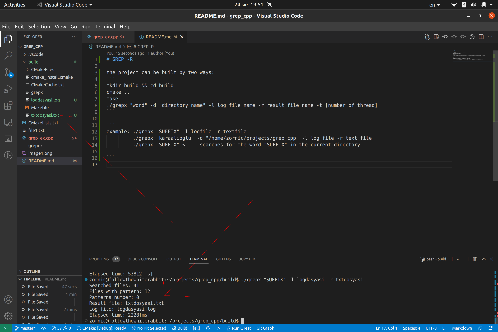
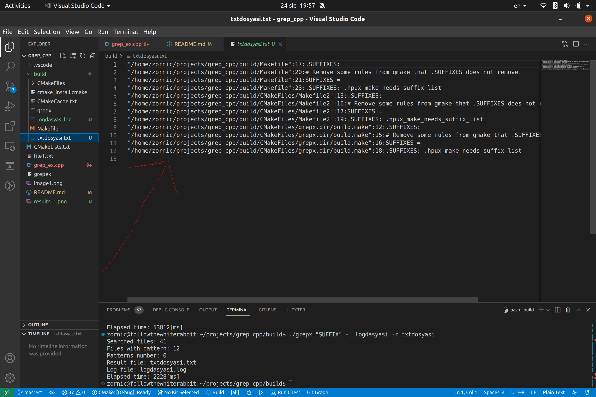

# GREP -R 


the project can be built by two ways:

- 1 (using CMAKE)

```
mkdir build && cd build 
cmake ..
make
./grepx "word" -d "directory_name" -l log_file_name -r result_file_name -t [number_of_thread]
```

```
example: ./grepx "SUFFIX" -l logfile -r textfile
         ./grepx "karaalioglu" -d "/home/zornic/projects/grep_cpp" -l log_file -r text_file
         ./grepx "SUFFIX" <---- searches for the word "SUFFIX" in the current directory 

```

- 2 (with the appropriate flags from the current working directory)

```
g++ -std=c++17 -pthread grep_ex.cpp -o grepex
./grepex "karaalioglu" -d "/home/zornic/projects/grep_cpp" -l log_dosyasi -r text_dosyasi

```

<p align="center">
  
  
</p>

### The program is still in development, thread_pools option is not added yet. 
### for the -t flag program doesn't work, so the log file is not filled up with the thread_ids. 

